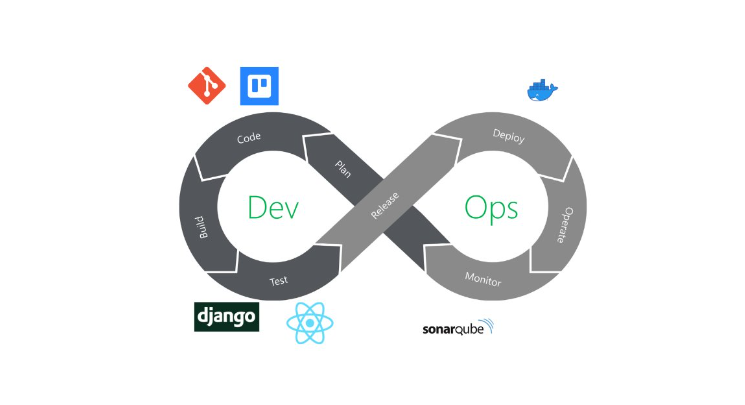

# Go4Success - Documentation générale.

Ce document sert à aider des développeurs futur à continuer le projet _Go4Success_ en donnant des directives par rapport
au fonctionnement du projet.

## Technologies utilisées

### Back-end

Pour le côté serveur de l'application, nous utilisons le framework de web dev Django. Nous utilisons l'API Rest de
Django pour faire communiquer le serveur et le client.

### Front-end

Du côté client, puisqu'il faisait partie des éxigences du projet que l'application tourne sur web et sur mobile, nous
avons opté pour l'utilisation du framework JavaScript React Native. Tous nos fichiers de code source du front-end sont
écrits en TypeScript.

### Base de donnée

Pour faire tourner notre base de donnée, nous utilisons le moteur de container Docker. La base de donnée elle-même
tourne sur PostgreSQL.

La documentation plus complète de la base de donnée se trouve dans le dossier `apps/database/` où vous y trouverez un
fichier .lun ouvrable dans le logiciel DB-Main. Ce fichier vous donnera accès au modèle entité relation de la base de
donnée ainsi que le schéma relationel. Si vous rencontrez des problèmes à utiliser DB-Main, des fichiers .PNG sont mis à
votre disposition pour pouvoir visionner les schémas.

## Structure des fichiers

### Racine du projet

-   _.prettierrc_ : contient les règles utilisées par _Prettier_ pour formatter le code.

### _apps/frontend/_

Ce dossier contient tout le code frontend du programme.

Vous trouverez à la racine du dossier deux fichiers docker permettant de lancer le client du programme dans un container Docker. Pour plus de détails, référez-vous au document 'Docker management.md' dans la documentation."

#### _go4success/_

-   **_app/_** contient le code source de l'application
-   **_assets/_** contient les images et autres éléments statiques affichés dans l'application.
-   **_components/_** contient tous les composants react que nous réutilisons à travers l'application.
-   **_constants/_** contient toutes constantes utilisées dans l'application. Notamment les couleurs, les tailles de
    d'écran pour les différentes platformes, etc.
-   **_context/_** contient les contextes react que nous utilisons à travers toute l'application. Essentiellement pour
    l'authentification de l'utilisateur, donc c'est **une partie centrale du code frontend.**
-   **_hooks/_** contient les différents hooks react utilisés dans l'application.
-   **_locales/_** contient les json pour les dictionnaires de traduction i18n pour les langues de l'application.
-   **_styles/_** contient les fichiers de style "css". Ici, nous avons essentiellement mis une fiche de style dites
    global, réutilisé un peu partout dans l'application, car les fiches de style un peu plus locale sont directement dans
    les fichiers de code .tsx
-   **_types/_** contient les différents types typescript utilisés à travers l'application.
-   **_utils/_** contient des fonctions utilitaires (pour faire des requetes au serveur django ou autre) que nous
    détailleront plus en détails dans la doc technique, avec des
    exemples d'utilisation.

#### _go4success/app/_

Ce dossier contient deux parties de l'application :

-   **_(auth)_** contient les pages permettant l'inscription et la connexion d'utilisateurs. **L'utilisateur pourra
    accéder
    à ces pages uniquement s'il n'est pas encore connecté à l'application.**
-   **_(app)_** contient le reste de l'application, **accessible uniquement si l'utilisateur est connecté**. Il est
    important de noter que chaque fichier dans ce dossier
    correspond à une page s'affichant dans le menu de l'application.
-   **Notes :** La gestion d'accès aux pages d'authentification et au reste de l'application, selon le statut de
    l'utilisateur (connecté ou non) est géré par le contexte **Auth.tsx**, situé dans le dossier
    **apps/frontend/go4success/context/**

### _apps/backend/_

Ce dossier contient tout le code backend du programme. La structure des fichiers suit une structure de fichiers du framework Django.

Le backend possède plusieurs applications django (activities, authentication, database, rolemanagement,..), chacun dans le dossier backend, et portant un nom représentant la fonctionnaité, ormis le dossier **server**, qui gère l'application django et ses paramètres (avec le fichiers setting, urls, ...).

-   **apps/backend**

    -   **activities**
        -   (...) _# application django_
    -   **authentication**
        -   (...)
    -   **database**
        -   (...)
    -   **feedback**
        -   (...)
    -   **rolemanagement**
        -   (...)
    -   **postQuestionnaire**
        -   (...)
    -   **server**
        -   (...) _# serveur django_

Chaque application contient une liste de fichier Vues, Serializers, Urls et Tests. Dans le point suivant (Applications django), nous explorerons en détail le contenu de chaque application.

## Structure des Fichiers Front-End

### **apps/frontend/go4success/app/(app)/questionnaire.tsx**

#### Description générale

Ce fichier permet d'afficher le questionnaire.

#### Importations

Le code importe plusieurs modules et composants nécessaires :

-   `React`, `useEffect`, `useState` de `react` pour la gestion de l'état et des effets.
-   Des hooks personnalisés `useCourses` et `usePostQuestionnaire` pour les opérations liées aux questionnaires. - Diverses fonctionnalités de navigation depuis `@react-navigation/native` et `@react-navigation/stack`.
-   `Toast` de `react-native-toast-message` pour afficher des notifications.
-   Composants UI de `react-native` pour la mise en page et les interactions utilisateur.
-   `DateTimePicker` de `react-native-ui-datepicker` pour la sélection des dates.
-   `dayjs` pour la manipulation des dates. - Styles et constantes personnalisées de l'application (`stylesGlobal`, `Colors`).

#### Types

Le code définit plusieurs types TypeScript pour la validation et l'auto-complétion :

-   `RouteParams` : contient les paramètres `courseCode` et `courseName`.
-   `RootStackParamList` : type de navigation pour le questionnaire.
-   `QuestionnaireRouteProp` : type de la route pour le questionnaire.
-   `QuestionnaireComponentProps` : type des props pour `QuestionnaireComponent`.

#### Composant

-   `QuestionnaireComponent` : Ce composant gère l'affichage du formulaire de création de questionnaire.

#### États locaux

-   `startdate` et `enddate` : gèrent les dates de début et de fin du questionnaire.
-   `formData` : gère les données du formulaire.

#### Effet `useEffect`

Mise à jour des dates de début et de fin dans les données du formulaire chaque fois que les dates changent.

#### Méthodes

-   `handleChange` : met à jour les données du formulaire en fonction des modifications de l'utilisateur.
-   `handleSubmit` : envoie les données du formulaire lorsque l'utilisateur soumet le formulaire et affiche une notification de succès.

#### Rendu

Le composant rend un formulaire de création de questionnaire avec : - Des champs de texte pour le titre, la description et les points totaux. - Des sélecteurs de date pour les dates de début et de fin. - Un sélecteur de langue. - Un bouton pour soumettre le formulaire.

#### Gestion des erreurs

Si une erreur se produit lors de l'envoi du formulaire, elle est affichée à l'utilisateur.

#### Fonction principale `App`

-   Gère l'état `showQuestion` pour afficher soit le composant `QuestionnaireComponent`, soit le composant `Question`.

#### Styles

Le fichier contient des styles personnalisés pour divers éléments du formulaire, définis avec `StyleSheet.create`.

#### Utilisation

Pour utiliser ce composant dans une application React Native, il faut s'assurer que les hooks `useCourses`
et `usePostQuestionnaire`, ainsi que les styles et constantes personnalisés (`stylesGlobal`, `Colors`), soient
correctement définis et importés.

#### Exemple d'utilisation

```jsx
import React from "react";
import { NavigationContainer } from "@react-navigation/native";
import { createStackNavigator } from "@react-navigation/stack";
import App from "./App"; // le fichier contenant le code ci-dessus

const Stack = createStackNavigator();

export default function Main() {
    return (
        <NavigationContainer>
            <Stack.Navigator initialRouteName="Questionnaire">
                <Stack.Screen name="Questionnaire" component={App} />
                {/* Ajoutez d'autres écrans ici si nécessaire */}
            </Stack.Navigator>
        </NavigationContainer>
    );
}
```

### **apps/frontend/go4success/app/(app)/question.tsx**

#### Description générale

Ce fichier définit plusieurs composants pour gérer la création et l'affichage de questions dans un questionnaire, notamment des questions ouvertes et des questions fermées. Il utilise diverses bibliothèques et hooks pour faciliter les opérations CRUD sur les questions.

#### Importations

Le code importe plusieurs modules et composants nécessaires :

-   `React`, `useState`, `useEffect` de `react` pour la gestion de l'état et des effets.
-   Divers composants UI de `react-native` pour la mise en page et les interactions utilisateur.
-   `Toast` de `react-native-toast-message` pour afficher des notifications.
-   Plusieurs hooks
    personnalisés (`useLastQuestionnaire`, `usePostOpenQuestion`, `usePostQuestion`, `useGetQuestions`, `usePostClosedQuestion`)
    pour les opérations liées aux questionnaires.
-   `useMutation`, `useQueryClient` de `@tanstack/react-query` pour la gestion des requêtes et mutations.
-   `ButtonComponent` pour les boutons personnalisés.
-   `stylesGlobal` pour les styles globaux de l'application.

#### Types

Le code définit plusieurs interfaces TypeScript pour la validation et l'auto-complétion :

-   `ClosedQuestion` : définit la structure d'une question fermée.
-   `OpenQuestion` : définit la structure d'une question ouverte.
-   `refetchedQuestions` : définit la structure des questions récupérées.
-   `closedQuestionToSend` : définit la structure des questions fermées à envoyer.

#### Composant `QuestionBox`

Ce composant gère l'affichage et la manipulation des questions d'un questionnaire.

##### États locaux

-   `modalVisible` : contrôle la visibilité de la modal.
-   `openQuestions` : stocke les questions ouvertes.
-   `closedQuestions` : stocke les questions fermées.
-   `closedQuestionsProcessed` : indique si les questions fermées ont été traitées.
-   `refetchQuestionsData` : stocke les données des questions récupérées.

##### Effet `useEffect`

Met à jour les données des questions récupérées lorsque les questions fermées sont traitées.

##### Méthodes

-   `handleOpenQuestion` : ajoute une question ouverte.
-   `handleAddClosedQuestion` : ajoute une question fermée.
-   `handleSaveOpenQuestions` : sauvegarde les questions ouvertes et fermées, et affiche une notification.

##### Rendu

Le composant rend un formulaire pour créer des questions ouvertes et fermées, avec des options pour ajouter des questions et les sauvegarder.

#### Composant `OpenQuestionBox`

Ce composant gère l'affichage et la manipulation d'une question ouverte.

##### États locaux

-   `question` : texte de la question ouverte.
-   `points` : points attribués à la question.

##### Méthodes

-   `handleSaveQuestion` : sauvegarde la question ouverte et affiche une notification.

##### Rendu

Le composant rend un formulaire pour entrer le texte et les points de la question ouverte, avec un bouton pour sauvegarder la question.

#### Composant `ClosedQuestionBox`

Ce composant gère l'affichage et la manipulation d'une question fermée.

##### États locaux

-   `question` : texte de la question fermée.
-   `options` : options de la question fermée.
-   `points` : points attribués à la question.

##### Méthodes

-   `handleCheck` : coche ou décoche une option.
-   `handleAddOption` : ajoute une nouvelle option.
-   `handleOptionChange` : modifie le texte d'une option.
-   `handleSaveQuestion` : sauvegarde la question fermée et affiche une notification.

##### Rendu

Le composant rend un formulaire pour entrer le texte et les points de la question fermée, gérer les options, et un bouton pour sauvegarder la question.

#### Composant `Question`

Ce composant gère l'affichage du composant `QuestionBox` et des questions fermées.

##### États locaux

-   `closedQuestionVisible` : contrôle la visibilité des questions fermées.
-   `questionCount` : compte le nombre de questions.
-   `questionnaire` : récupère le dernier questionnaire.

##### Méthodes

-   `handleAddQuestion` : ajoute une nouvelle question fermée.

##### Rendu

Le composant rend un formulaire pour ajouter et afficher les questions du questionnaire.

#### Styles

Le fichier contient des styles personnalisés pour divers éléments du formulaire, définis avec `StyleSheet.create`.

#### Utilisation

Pour utiliser ce composant dans une application React Native, il faut s'assurer que les hooks et composants nécessaires soient correctement définis et importés.

### **apps/frontend/go4success/app/(app)/feedbackanswer.tsx**

#### Description générale

Ce composant est utilisé pour permettre à l'utilisateur de répondre à un feedback dans l'application.

#### Importations

Le code importe plusieurs modules et composants nécessaires :

-   `React`, `useState`, `useCallback` de `react` pour la gestion de l'état et des effets.
-   Divers composants UI de `react-native` pour la mise en page et les interactions utilisateur.
-   `Toast` de `react-native-toast-message` pour afficher des notifications.
-   Des hooks personnalisés (`useFeedback`, `useActivities`) pour les opérations liées aux feedbacks.
-   `ButtonComponent` pour les boutons personnalisés.
-   `stylesGlobal` pour les styles globaux de l'application.
-   `StackScreenProps` pour les propriétés de navigation entre les écrans.
-   `useRoute` et `RouteProp` pour accéder aux propriétés de la route actuelle.
-   `fetchBackend` pour effectuer des requêtes vers le backend.
-   `useAuth` pour accéder au contexte d'authentification.
-   `isMobile`, `isTablet`, `isTabletMini` pour déterminer le type d'appareil utilisé.
-   `InputAutocomplete` pour un champ de saisie avec - autocomplétion.
-   `useNavigation` pour la navigation entre les écrans.
-   `t` pour la traduction des textes.

#### Types

Le code définit plusieurs interfaces TypeScript :

-   `FeedbackAnswerScreenProps` & `RootStackParamList` : Permet la navigation.

#### États locaux

-   `route` et `navigation` : Ces constantes sont utilisées pour accéder aux propriétés de la route actuelle et aux fonctions de navigation.
-   `activityId` : Cette constante stocke l'ID de l'activité actuelle, qui est passé en paramètre de route.
-   `evaluation`, `positivePoint`, `negativePoint`, suggestion, additionalComment : Ces états stockent les réponses de l'utilisateur au feedback. Ils sont initialisés à une chaîne de caractères vide.
-   `user` : Cette constante stocke les informations de l'utilisateur actuellement connecté.
-   `activityInformations` : Cette constante stocke les informations sur l'activité actuelle, qui sont récupérées à l'aide du hook useActivities.
-   `feedbacks` : Cette constante stocke la liste des feedbacks pour l'activité actuelle.
-   `firstFeedbackId` : Cette constante stocke l'ID du premier feedback, ou une chaîne de caractères vide si aucun feedback n'est disponible.
-   `feedbackAdditionalQuestions` : Cette constante stocke les questions supplémentaires pour le premier feedback.
-   `responses` : Cet état stocke les réponses de l'utilisateur aux questions supplémentaires. Il est initialisé à un objet vide.

#### Méthodes

-   `validateResponses` : Cette fonction vérifie que toutes les réponses nécessaires ont été fournies par l'utilisateur. Elle renvoie true si toutes les réponses sont valides, et false sinon.
-   `evaluationCallback` : Cette fonction est appelée lorsque l'utilisateur sélectionne un niveau de satisfaction. Elle met à jour l'état evaluation avec la valeur sélectionnée.
-   `handleResponseChange` : : Cette fonction est appelée lorsque l'utilisateur modifie une de ses réponses. Elle met à jour l'état correspondant avec la nouvelle valeur.
-   `handleSendFeedback` : Cette fonction est appelée lorsque l'utilisateur soumet le formulaire de feedback. Elle valide les réponses, affiche un message d'erreur si nécessaire, et envoie les réponses si elles sont valides.

#### Rendu

Le composant est rendu en tant que formulaire dans une interface utilisateur. Il comprend plusieurs champs d'entrée, un bouton de soumission, et un message de toast pour afficher les erreurs.

#### Gestion des erreurs

Les erreurs sont gérées en affichant un message de toast à l'utilisateur lorsque quelque chose ne va pas, par exemple lorsque la soumission du formulaire échoue.

#### Styles

Les styles sont définis à la fois globalement et localement pour ce composant.

### **apps/frontend/go4success/app/(app)/feedbackcreate.tsx**

#### Description générale

Ce fichier permet la création de feedback pour une activité.

#### Importations

Le code importe plusieurs modules et composants nécessaires :

-   `React`, `useState`, `useCallback`, `useEffect` de `react` pour la gestion de l'état et des effets.
-   Divers composants UI de `react-native` pour la mise en page et les interactions utilisateur.
-   `Toast` de `react-native-toast-message` pour afficher des notifications.
-   Des hooks personnalisés (`useFeedback`, `useActivities`, `useGives`) pour les opérations liées aux feedbacks.
-   `ButtonComponent` pour les boutons personnalisés.
-   `stylesGlobal` pour les styles globaux de l'application.
-   `BouncyCheckbox` pour les cases à cocher interactives.
-   `useTranslation` pour la traduction des textes.
-   `DateTimePicker` pour le choix de la date.
-   `dayjs` pour manipuler les dates.
-   `useNavigation` pour la navigation entre les écrans.
-   `useAuth` pour accéder au contexte d'authentification.
-   `fetchBackend` pour effectuer des requêtes vers le backend.
-   `convertDateToISO` pour convertir les dates au format ISO.
-   `isMobile`, `isTablet`, `isTabletMini` pour déterminer le type d'appareil utilisé.
-   `InputAutocomplete` pour un champ de saisie avec autocomplétion.
-   `Colors` pour les couleurs utilisées dans l'application.
-   `SelectItem` pour le type des éléments de sélection.

#### États locaux

-   `t` : Cette constante est utilisée pour la traduction des textes.
-   `navigation` : Cette constante est utilisée pour la navigation entre les écrans.
-   `user` : Cette constante stocke les informations de l'utilisateur actuellement connecté.
-   `isCheckedPositivePoint`, `isCheckedNegativePoint`, `isCheckedSuggestion`, `isCheckedAdditionalComment` : Ces états stockent si les points positifs, négatifs, les suggestions et les commentaires supplémentaires sont cochés. Ils sont initialisés à true.
-   `customQuestions` : Cet état stocke les questions personnalisées. Il est initialisé à un tableau vide.
-   `date` : Cet état stocke la date sélectionnée. Il est initialisé à la date actuelle.
-   `selectedActivity` : Cet état stocke l'activité sélectionnée. Il est initialisé à une chaîne de caractères vide.
-   `allFeedbacks`, `feedbackError` : Ces constantes stockent la liste des feedbacks et une éventuelle erreur lors de la récupération des feedbacks.
-   `filteredActivities` : Cet état stocke la liste des activités filtrées. Il est initialisé à un tableau vide.
-   `allGives`, `givesError` : Ces constantes stockent la liste des dons et une éventuelle erreur lors de la récupération des dons.
-   `allActivitiesData`, `activityError` : Ces constantes stockent la liste des activités et une éventuelle erreur lors de la récupération des activités.

#### Méthodes

-   `activityCallback` : Cette méthode est une fonction de rappel qui est utilisée pour mettre à jour l'activité sélectionnée
-   `handleSendFeedback` : Cette méthode est utilisée pour gérer l'envoi des commentaires. Elle vérifie d'abord si une activité a été sélectionnée. Si ce n'est pas le cas, elle affiche un message d'erreur. Sinon, elle crée un objet feedbackDataDefault avec les informations du feedback et fait une requête POST pour créer un nouveau feedback. Si des questions personnalisées ont été ajoutées, elle les envoie également via une autre requête POST. En cas de succès, un message de succès est affiché, sinon, un message d'erreur est affiché.
-   `addQuestion` : Cette méthode est utilisée pour ajouter une nouvelle question personnalisée. Elle met à jour l'état customQuestions en ajoutant une nouvelle chaîne vide à la fin du tableau.
-   `updateQuestion` : Cette méthode est utilisée pour mettre à jour une question personnalisée existante. Elle prend en paramètres le texte de la nouvelle question et l'index de la question à mettre à jour.

#### Rendu

Le composant est rendu en tant que formulaire dans une interface utilisateur. Il comprend plusieurs champs d'entrée, un bouton de soumission, et un message de toast pour afficher les erreurs ou réussite.

#### Gestion des erreurs

Le composant gère les erreurs à plusieurs endroits :

Dans le crochet `useEffect` qui définit les activités filtrées, il réinitialise l'activité sélectionnée en cas d'erreur dans la récupération des feedbacks ou des activités.
Dans la fonction `handleSendFeedback`, il affiche un message de toast en cas d'erreur lors de l'envoi du retour d'information.
La méthode render renvoie un message d'erreur en cas d'erreur dans l'extraction des activités, des commentaires ou des résultats.

#### Styles

Les styles sont définis à la fois globalement et localement pour ce composant.

### **apps/frontend/go4success/app/(app)/feedbacklist.tsx**

#### Description générale

Ce fichier permet d'afficher la liste des activités où nous avons des feedbacks disponibles.

#### Importations

Le code importe plusieurs modules et composants nécessaires :

-   `React` de `react` pour la gestion de l'état et des effets.
-   Divers composants UI de `react-native` pour la mise en page et les interactions utilisateur.
-   Un hook personnalisé (`useFeedback`) pour les opérations liées aux feedbacks.
-   `ButtonComponent` pour les boutons personnalisés.
-   `stylesGlobal` pour les styles globaux de l'application.
-   `useTranslation` pour la traduction des textes.
-   `useNavigation` et `StackNavigationProp` pour la navigation entre les écrans.
-   `useAuth` pour accéder au contexte d'authentification.
-   `TableColumn` est utilisé pour définir les colonnes d'un tableau de données.
-   `FeedbackTable` est utilisé pour créer le tableau.

#### Types

Le code définit plusieurs interfaces TypeScript :

-   `FeedbackListDetailsScreenNavigationProp` & `RootStackParamList` : Permet la navigation.

#### États locaux

-   `user` : utilise le hook useAuth pour extraire l'utilisateur actuellement connecté.
-   `feedbacks`: utilise le hook useFeedback pour récupérer les feedbacks. Si l'utilisateur est un superutilisateur, tous les feedbacks sont récupérés, sinon, seuls les feedbacks de l'utilisateur connecté sont récupérés.
-   `t` pour la traduction des textes.
-   `useNavigation` pour la navigation entre les écrans.
-   `columns` : définit un tableau de colonnes pour le tableau de feedbacks. Chaque colonne a un nom, une fonction de sélection pour extraire la valeur de la colonne à partir d'un feedback, une propriété sortable pour indiquer si la colonne peut être triée, et une propriété grow pour indiquer combien de place la colonne doit prendre par rapport aux autres colonnes.

#### Rendu

Affichage d'un tableau avec des boutons pour ouvrir une autre page associée à l'activité choisie.

#### Gestion des erreurs

Des erreurs sont affichées sur la page si une erreur se produit dans le hook.

#### Styles

Les styles sont définis globalement pour ce composant.

### **apps/frontend/go4success/app/(app)/feedbackdetails.tsx**

#### Description générale

Ce fichier permet d'afficher la liste des feedbacks et ses détails des utilisateurs pour une activité.

#### Importations

Le code importe plusieurs modules et composants nécessaires :

-   `React`, `useState` de `react` pour la gestion de l'état et des effets.
-   Divers composants UI de `react-native` pour la mise en page et les interactions utilisateur.
-   Un hook personnalisé (`useFeedback`) pour les opérations liées aux feedbacks.
-   `ButtonComponent` pour les boutons personnalisés.
-   `stylesGlobal` pour les styles globaux de l'application.
-   `useTranslation` pour la traduction des textes.
-   `useNavigation`, `StackNavigationProp`,`RouteProp` et `useRoute` pour la navigation entre les écrans.
-   `useAuth` pour accéder au contexte d'authentification.
-   `TableColumn` est utilisé pour définir les colonnes d'un tableau de données.
-   `FeedbackStudentTable` est utilisé pour créer le tableau.
-   `StackScreenProps` pour les propriétés de navigation entre les écrans.
-   `Colors` pour les couleurs utilisées dans l'application.
-   `FeedbackStudent` pour récupérer le type.

#### Types

Le code définit plusieurs interfaces TypeScript :

-   `FeedbackListDetailsScreenProps` & `RootStackParamList` : Permet la navigation.

#### États locaux

-   `t` pour la traduction des textes.
-   `route` et `navigation` utilisées pour accéder aux propriétés de la route
-   `feedbackId` récupère l'ID du feedback à partir des paramètres de la route.
-   `activityName` récupère le nom de l'activité à partir des paramètres de la route.
-   `feedbackStudent` utilise le hook useFeedbackStudent pour récupérer le feedback et une éventuelle erreur.
-   `modalVisible` indique si le modal est visible ou non (Default : False).
-   `selectedFeedback` permet de save le feedback choisi.
-   `satisfactionLevels` définit un tableau de niveaux de satisfaction avec leurs valeurs et leurs labels traduits.
-   `feedbackstudentadditionnalquestions` utilise le hook useFeedbackStudentAdditionalQuestions pour récupérer les questions supplémentaires du feedback sélectionné.

#### Méthodes

-   `handleOpenModal` : Cette méthode est utilisée pour ouvrir un modal.
-   `getLabelFromValue` : Cette méthode est utilisée pour obtenir le label correspondant à une valeur donnée dans le tableau satisfactionLevels.

#### Rendu

Affichage d'un tableau avec des boutons pour ouvrir plus de détails sur le feedback.

#### Gestion des erreurs

Des erreurs sont affichées sur la page si une erreur se produit dans le hook.

#### Styles

Les styles sont définis globalement pour ce composant.

### **apps/frontend/go4success/app/(app)/????.tsx**

TODO

#### Description générale

#### Importations

#### Types

#### Composant

#### États locaux

#### Méthodes

#### Rendu

#### Gestion des erreurs

#### Styles

#### Utilisation

#### Exemple d'utilisation

## Applications django

Détaillons à present chaque applications django et ses fonctionnalités.

### Activities

Cette application fait la gestion des ateliers : s'inscrire à l'atelier, se déinscrire des ateliers, filter les ateliers.

#### Vues (Activities)

-   **RoomViewSet:** Ce viewset fournit un accès en lecture seule au modèle Room. Il comprend une méthode
    get_rooms_by_site qui prend un site_id en paramètre et renvoie toutes les salles associées à ce site.
-   **SiteViewSet:** Ce viewset fournit un accès complet CRUD (Create, Read, Update, Delete) au modèle Site.
-   **LanguageViewSet:** Ce viewset fournit un accès complet CRUD au modèle Language.
-   **ActivityViewSet:** Ce viewset fournit un accès complet CRUD au modèle Activity. Il surcharge la méthode get_queryset
    pour ne renvoyer que les activités pour lesquelles l'utilisateur actuel ne s'est pas inscrit. La méthode create est
    également surchargée pour gérer une manipulation spécifique des données avant de créer une activité.
-   **AttendViewSet:** Ce viewset fournit un accès complet CRUD au modèle Attend. Il surcharge la méthode get_queryset
    pour ne renvoyer que les participations associées à l'utilisateur actuel.
-   **filter_queryset:** Il s'agit d'une fonction d'aide utilisée dans ActivityViewSet et AttendViewSet pour filtrer le
    queryset en fonction des paramètres de la requête. Elle supporte le filtrage par name, site, room, date_start,
    date_end, et language.
-   **RegisterToActivityView:** Ce viewset fournit un accès complet CRUD au modèle Attend pour les utilisateurs
    authentifiés. Il utilise le RegisterToActivitySerializer pour gérer la sérialisation des données.

#### Serializers (Activities)

Nous allons pas détailler les serializers, car ils sont très simples et sont utilisés pour la validation des données.
Nous allons néanmoins les citer et les décrire brièvement.

-   **RoomSerializer:** Ce serializer est utilisé pour valider les données des locaux.
-   **CourseSerializer:** Ce serializer est utilisé pour valider les données des cours.
-   **LanguageSerializer:** Ce serializer est utilisé pour valider les données des langues.
-   **ActivitySerializer:** Ce serializer est utilisé pour valider les données des activités.
-   **AttendSerializer:** Ce serializer est utilisé pour valider les données des activités où un utilisateurs authentifié
    est inscrit.
-   **SiteSerializer:** Ce serializer est utilisé pour valider les données des villes.
-   **RegisterToActivitySerializer:** Ce serializer est utilisé pour valider les données d'inscription à une activité.

#### Urls (Activities)

Les différentes urls de l'application _activities_ sont définies dans le fichier _urls.py_. Elles sont en liens avec les vues décrites plus haut.

#### Tests (Activities)

Conntient un ensemble de tests pour vérifier les éléments suivants :

-   **RoomViewSetTestCase:**
    -   _test_get_room_ : Ce test vérifie que l'API renvoie correctement toutes les salles.
    -   _test_get_room_not_found_ : Ce test vérifie que l'API renvoie une erreur 404 lorsque l'on tente d'accéder à une
        salle qui n'existe pas.
-   **ActivityViewSetTestCase:**
    -   _test_get_all_activities_ : Ce test vérifie que l'API renvoie correctement toutes les activités.
-   **AttendSerializerTest:**
    -   _test_attend_serializer_ : Ce test vérifie que le sérialiseur Attend fonctionne correctement et renvoie les
        données attendues.
    -   _test_unattend_activity_ : Ce test vérifie que l'API permet à un utilisateur de se désinscrire d'une activité et
        renvoie le code de statut HTTP 204. Il vérifie également que l'objet Attend est correctement supprimé de la base
        de données.

### Authentication

Cette application gère l'authentification d'un utilisateur : l'inscription, la connexion, la déconnexion, les notifications avec Expo Push Notification : https://docs.expo.dev/push-notifications/overview/

#### Vues (Authentication)

Nous avons plusieurs vues essentiels aux fonctionnent de l'authentifications, que nous allors détailler ici. Elles sont
de plusieurs sortes : APIView, ViewSet, etc.

Nous vous mettons les liens de la documentation des APIView et des ViewSet, pour plus d'information sur ces vues.

-   APIView : https://www.django-rest-framework.org/api-guide/views/
-   ViewSet : https://www.django-rest-framework.org/api-guide/viewsets/
-   ModelViewSet : https://www.django-rest-framework.org/api-guide/viewsets/#modelviewset
-   GenericAPIView : https://www.django-rest-framework.org/api-guide/generic-views/
-   UpdateAPIView : https://www.django-rest-framework.org/api-guide/generic-views/#updateapiview
-   DestroyAPIView : https://www.django-rest-framework.org/api-guide/generic-views/#destroyapiview

Les vues sont les suivantes :

-   **_UserRegisterView_** : La vue qui s'occupe d'inscrire les utilisateurs. Elle reçoit les information de l'inscription
    dans la requête POST.

```tsx
// Exemple d'interaction de la vue UserRegisterView en frontend avec react
import { UserRegister } from "@/types/UserRegister";
import { fetchBackend } from "@/utils/fetchBackend";
import { fetchError } from "@/utils/fetchError";

// Ceci est une fonction qui permet d'inscrire un utilisateur,
// mais le plus important est la fonction fetchBackend qui fait une requête au serveur django.
const signUp = async (userData: UserRegister) => {
    try {
        // fetchBackend est une fonction utilitaire qui fait une requête au serveur django.
        // Elle est détaillée dans la section utils du frontend.
        const { data: success } = await fetchBackend({
            type: "POST",
            url: "auth/register/",
            data: {
                username: userData.username,
                email: userData.email,
                // eslint-disable-next-line camelcase
                last_name: userData.lastName,
                // eslint-disable-next-line camelcase
                first_name: userData.firstName,
                noma: userData.noma,
                password: userData.password,
            },
        });

        if (success) {
            // Ces instructions sont essentiels pour la déconnexion.
            // Elles ajoutent les tokens dans le local storage
            // et mettent à jour le contexte de l'utilisateur.
            await AsyncStorage.setItem("accessToken", success.access);
            await AsyncStorage.setItem("refreshToken", success.refresh);

            await queryClient.invalidateQueries({
                queryKey: ["current_user"],
            });

            // {...} gestion du success de l'inscription avec des Toast ou autre
        }
    } catch (err) {
        const error = err as fetchError;
        // {...} gestion de l'erreur. Exemple :
        if (error.responseError.status === 401) {
            // {...} gestion de l'erreur 401
        }
    }
};
```

-   **_TokenObtainPairView_ (LoginView)** : Cette vue vient directement du framework **rest_framework_simple_jwt** et
    s'occupe de
    vérifier les credentials de l'utilisateur pour que celui-ci puisse se connecter. La vue fait des requetes POST, en
    utilisant une username et un password, et renvoie un token d'authentification (access et refresh token) si les
    credentials sont valides.

```tsx
// Exemple d'interaction de la vue TokenObtainPairView en frontend avec react
import { UserLogin } from "@/types/UserLogin";
import { fetchBackend } from "@/utils/fetchBackend";
import { fetchError } from "@/utils/fetchError";
import AsyncStorage from "@react-native-async-storage/async-storage";
import { queryClient } from "@/context/AuthContext";

const signIn = async (userData: UserLogin) => {
    try {
        const { data: success } = await fetchBackend({
            type: "POST",
            url: "auth/token/",
            data: {
                username: userData.username,
                password: userData.password,
            },
        });

        if (success) {
            // Ces instructions sont essentiels pour la déconnexion.
            // Elles ajoutent les tokens dans le local storage
            // et mettent à jour le contexte de l'utilisateur.
            await AsyncStorage.setItem("accessToken", success.access);
            await AsyncStorage.setItem("refreshToken", success.refresh);

            await queryClient.invalidateQueries({
                queryKey: ["current_user"],
            });

            // {...} gestion du success de la connexion avec des Toast ou autre
        }
    } catch (err) {
        const error = err as fetchError;
        // {...} gestion de l'erreur. Exemple :
        if (error.responseError.status === 401) {
            // {...} gestion de l'erreur 401
        }
    }
};
```

-   **_LogoutView_** : Il n'y pas de vue de déconnexion, car la déconnexion se fait automatiquement en supprimant le
    token (access et refresh) de l'utilisateur. Cela se fait en frontend, en supprimant les tokens du local storage.

```tsx
// Exemple de déconnexion en frontend avec react
import AsyncStorage from "@react-native-async-storage/async-storage";
import { queryClient } from "@/context/AuthContext";
import { fetchError } from "@/utils/fetchError";

const signOut = async () => {
    try {
        // Ces instructions sont essentiels pour la déconnexion.
        // Elles suppriment les tokens du local storage
        // et mettent à jour le contexte de l'utilisateur.
        await AsyncStorage.removeItem("accessToken");
        await AsyncStorage.removeItem("refreshToken");

        await queryClient.invalidateQueries({
            queryKey: ["current_user"],
        });

        // {...} gestion du success de la déconnexion avec des Toast ou autre
    } catch (err) {
        const error = err as fetchError;
        // {...} gestion de l'erreur
    }
};
```

-   **_CurrentUserView_** : fonctionne avec un GET uniquement. Renvoie les informations de l'utilisateur connecté dans la
    session actuelle.

```tsx
import { useQuery } from "@tanstack/react-query";
import { fetchBackend } from "@/utils/fetchBackend";

export default function useUser() {
    const { isPending, data: user } = useQuery({
        queryKey: ["current_user"],
        queryFn: async () => {
            try {
                const { data: response } = await fetchBackend({
                    type: "GET",
                    url: "auth/current_user/",
                });
                return response;
            } catch (err) {
                await AsyncStorage.removeItem("accessToken");
                await AsyncStorage.removeItem("refreshToken");
                return null;
            }
        },
    });
    return { isPending, user };
}
```

-   **_UpdateProfileView_** : Permet à l'utilisateur de mettre à jour son profil. La vue fait une requête PATCH avec les
    nouvelles informations de l'utilisateur. Dans notre application, on utilise le PATCH pour mettre à jour seulement un
    attribut de l'utilisateur (comme le prénom uniquement par exemple). Mais le PUT peut être utilisé pour mettre à jour
    tout l'objet utilisateur.

```tsx
// Exemple de mise à jour du profil en frontend avec react
import { useMutation } from "@tanstack/react-query";
import { fetchBackend } from "@/utils/fetchBackend";
import { fetchError } from "@/utils/fetchError";
import { queryClient } from "@/app/_layout";
import { useTranslation } from "react-i18next";

const { t } = useTranslation();
dataKey = "first_name";
newData = "John";

const fetchData = useMutation({
    mutationFn: async () => {
        const data: { [index: string]: any } = {};
        data[dataKey] = newData; // dataKey représente l'attribut à mettre à jour
        await fetchBackend({
            type: "PATCH",
            url: "auth/user_profile/" + user.id + "/",
            data: data,
        });
    },
    onSuccess: async () => {
        // {...} gestion du success de la mise à jour du profil avec des Toast ou autre
        await queryClient.invalidateQueries({ queryKey: ["current_user"] });
    },
    onError: async (error: fetchError) => {
        const errorResponse = await error.responseError.json();
        const errorMessages =
            errorResponse[dataKey] ||
            t("translationProfile.defaultErrorMessage");
        // {...} gestion de l'erreur avec des toast ou autre
    },
});
```

-   **_DeleteUserView_** : Permet à l'utilisateur de supprimer son compte. La vue fait une requête DELETE pour supprimer
    l'utilisateur.

```tsx
// Exemple de suppression du profil en frontend avec react
import { useMutation } from "@tanstack/react-query";
import { fetchBackend } from "@/utils/fetchBackend";
import { queryClient } from "@/app/_layout";
import { useTranslation } from "react-i18next";

const { t } = useTranslation();
const { user } = useAuth();

const handleDeleteUser = useMutation({
    mutationFn: async () => {
        await fetchBackend({
            type: "DELETE",
            url: "auth/delete_user/" + user.id + "/",
        });
    },
    onSuccess: () => {
        // {...} gestion de la suppression du profil avec des Toast ou autre
        void queryClient.invalidateQueries({ queryKey: ["current_user"] });
    },

    onError: () => {
        // {...} gestion de l'erreur avec des toast ou autre
    },
});
```

-   **_ChangePasswordView_** : Permet à l'utilisateur de changer son mot de passe. La vue fait une requête PUT pour
    changer le mot de passe de l'utilisateur.

```tsx
// Exemple de changement de mot de passe en frontend avec react
import { useMutation } from "@tanstack/react-query";
import { fetchBackend } from "@/utils/fetchBackend";
import { fetchError } from "@/utils/fetchError";
import { queryClient } from "@/app/_layout";
import { useTranslation } from "react-i18next";

const { t } = useTranslation();
const { user } = useAuth();

const fetchData = useMutation({
    mutationFn: async () => {
        await fetchBackend({
            type: "PUT",
            url: "auth/change_password/" + user.id + "/",
            data: {
                // eslint-disable-next-line camelcase
                old_password: oldPassword,
                password: newPassword,
                password2: newPasswordConfirmation,
            },
        });
    },

    onSuccess: () => {
        // {...} gestion du success du changement de mot de passe avec des Toast ou autre
        void queryClient.invalidateQueries({ queryKey: ["current_user"] });
    },

    onError: async (error: fetchError) => {
        // {...} gestion de l'erreur avec des toast ou autre
    },
});
```

**Notes :** Si vous apercevez du texte inscrit de cette facon : **t("translationProfile.defaultErrorMessage")**. Cela
signifie que le texte est traduit dans le fichier de traduction i18n. Pour plus d'information sur la traduction,
veuillez consulter la section _locales_ du dossier _go4success_.

#### Serializers (Authentication)

Nous allons pas détailler les serializers, car ils sont très simples et sont utilisés pour la validation des données.
Nous allons néanmoins les citer et les décrire brièvement.

-   **UserRegistrationSerializer:** Ce serializer est utilisé pour valider les données d'inscription d'un utilisateur.
-   **UserSerializer:** Ce serializer est utilisé pour valider les données de l'utilisateur.
-   **UpdateUserSerializer:** Ce serializer est utilisé pour valider les données de mise à jour de l'utilisateur.
-   **ChangePasswordSerializer:** Ce serializer est utilisé pour valider les données de changement de mot de passe.

#### Validation (Authentication)

Dans le fichier _validations.py_ de l'application _authentication_, nous avons des méthodes qui s'occupent de valider les différents credentials donnés par un utilisateur, notamment le nom d'utilisateur, le mot de passe, l'email et le noma (matricule étudiant).

#### Urls (Authentication)

Les différentes urls de l'application _authentication_ sont définies dans le fichier _urls.py_. Elles sont en liens avec les vues décrites plus haut.

#### Tests (Authentication)

Pour les tests concernant l'authentification, veuillez consulter le fichier `tests_authentication.md` du dossier courant.

### Database

Comme son nom l'indique, cette application va gérer les base de données avec l'ORM de django et ses modèles.

#### Models (Database)

Voici les différents modèles :

-   **User :** Ce modèle représente l'utilisateur de l'application. Nous avons pour créer un modèle d'user par dessus
    celui
    fourni par django, afin d'y ajouter notamment le noma (matricule étudiant) Il contient les attributs suivants :

    -   **id** : l'identifiant de l'utilisateur pour la base de données.
    -   **username** : Le nom d'utilisateur de l'utilisateur.
    -   **email** : L'email de l'utilisateur.
    -   **first_name** : Le prénom de l'utilisateur.
    -   **last_name** : Le nom de famille de l'utilisateur.
    -   **noma** : Le matricule de l'utilisateur.
    -   **is_active** : Un booléen qui indique si l'utilisateur est actif.
    -   **is_staff** : Un booléen qui indique si l'utilisateur est un membre du staff.
    -   **is_superuser** : Un booléen qui indique si l'utilisateur est un super utilisateur.
    -   **date_join** : La date à laquelle l'utilisateur s'est inscrit.
    -   **last_login** : La date à laquelle l'utilisateur s'est connecté pour la dernière fois.

-   **Course :** Ce modèle représente un cours. Il contient les attributs suivants :

    -   **id** : l'identifiant du cours pour la base de données.
    -   **code** : La code du cours.
    -   **name** : Le nom du cours.
    -   **user** : Le professeur du cours.

-   **Site :** Ce modèle représente un site. Un site est le nom du campus. Il contient les attributs suivants :

    -   **id** : l'identifiant du site pour la base de données.
    -   **name** : Le nom du site.

-   **Room :** Ce modèle représente une classe/auditoire/amphithéatre. Il contient les attributs suivants :

    -   **id** : l'identifiant de la classe pour la base de données.
    -   **name** : Le nom de la classe.
    -   **site** : Le site où est situé la classe.

-   **Language :** Ce modèle représente une langue. Il contient les attributs suivants :

    -   **id** : l'identifiant de la langue pour la base de données.
    -   **name** : Le nom de la langue (Exemple: Français)s.
    -   **code** : Le code de la langue (Exemple: FR).

-   **Activity :** Ce modèle représente une activité. Il contient les attributs suivants :

    -   **id** : l'identifiant de l'activité pour la base de données.
    -   **name** : Le nom de l'activité.
    -   **description** : La description de l'activité.
    -   **start_date** : La date de début de l'activité.
    -   **end_date** : La date de fin de l'activité.
    -   **course** : Le cours de l'activité.
    -   **room** : La classe de l'activité.
    -   **language** : La langue de l'activité.

-   **Attend :** Ce modèle représente la relation entre un utilisateur et une activité. Il permet de savoir quel
    utilisateur est inscrit à quelle activité. Il contient les attributs :
    suivants :

    -   **activity** : L'activité.
    -   **student** : L'étudiant.

    **Notes :** Ici, l'identifiant pour la base de données est le tuple (activity, student) qui doit être unique.

-   **Teacher :** Ce modèle représente un professeur. Il contient les attributs suivants :

    -   **user** : L'utilisateur.
    -   **is_tutor** : Un booléan qui permet de savoir si l'utilisateur est un tuteur.
    -   **is_professor**: Un booléan qui permet de savoir si l'utilisateur est un professeur.
        **Notes:** Une contrainte est mise en place pour que l'utilisateur soit soit un tuteur, soit un professeur. Voir
        plus en détail dans la méthode _clean()_ du modèle.

-   **Give :** Ce modèle est une relation entre activité et professeur. Il permet de savoir quel professeur donne quel
    cours. Il contient les attributs suivants :

    -   **activity** : L'activité.
    -   **teacher** : Le professeur.

-   **Annoucement :** Ce modèle représente une annonce. Les annonces sont donnés par les professeur envers tous les
    étudiants. Il contient les attributs suivants :

    -   **id** : l'identifiant de l'annonce pour la base de données.
    -   **title** : Le titre de l'annonce.
    -   **description** : La description de l'annonce.
    -   **publication_date** : La date de publication de l'annonce.
    -   **teacher** : Le professeur qui a posté l'annonce.

-   **Registered :** Ce modèle représente une relation entre un étudiant et un cours. Elle permet de savoir quel étudiant
    est inscrit à quel cours. Il contient les attributs suivants :

    -   **student** : L'étudiant.
    -   **course** : Le cours.

-   **Message :** Ce modèle représente un message. Un message est émis entre deux étudiants. Il contient les attributs
    suivants :

    -   **id** : l'identifiant du message pour la base de données.
    -   **content** : Le contenu du message.
    -   **date** : La date du message.
    -   **to_user** : L'envoyeur du message.
    -   **from_user** : Le receveur du message.

-   **See :** Ce modèle représente une relation entre une annonce et un utilisateur. Il permet de savoir quel utilisateur
    a
    vu quel announce. Il contient les attributs suivants :

    -   **annoucement** : L'annonce émis par un professeur (modèle Teacher).
    -   **user** : L'utilisateur.

-   **Feedback :** Ce modèle represente un feedback pour une activité. Il contient
    les attributs suivants :

    -   **id** : L'identifiant du feedback pour la base de données.
    -   **user** : L'étudiant qui a donné le feedback.
    -   **activity** : L'activité pour laquelle le feedback est donné.
    -   **positive_point** : Si le feedback doit contenir des points positifs de l'activité.
    -   **negative_point** : Si le feedback doit contenir des points négatifs de l'activité.
    -   **suggestion** : Si le feedback doit contenir des suggestions pour améliorer l'activité.
    -   **additional_comment** : Si le feedback doit contenir des commentaires additionnels.
    -   **date_start** : La date de début du feedback.
    -   **date_end** : La date de fin du feedback.

-   **Feedback_Additional_Question :** Ce modèle permet d'ajouter des questions supplémentaires au feedback. Il contient
    les attributs suivants :

    -   **id**: L'identifiant de la question supplémentaire.
    -   **feedback** : Le feedback qui contient la question supplémentaire.
    -   **question** : La question supplémentaire.

-   **Feedback_Student :** Ce modèle represente la réponse pour un feedback écrit par un étudiant. Il contient les
    attributs suivants :

    -   **id** : L'identifiant du feedback pour la base de données.
    -   **student** : L'étudiant qui a donné le feedback.
    -   **feedback** : Le feedback à remplir.
    -   **evaluation** : Niveau statisification de l'acitivté (0-5).
    -   **positive_point** :Les points positifs de l'activité.
    -   **negative_point** :Les points négatifs de l'activité.
    -   **suggestion** : Les suggestions pour améliorer l'activité.
    -   **additional_comment** : Les commentaires additionnels.
    -   **date_submitted** : La date à laquelle le feedback a été soumis.

-   **Feedback_Student_Additional_Question :** Ce modèle permet de répondre aux questions supplémentaires d'un feedback.
    Il contient les attributs suivants :

    -   **id**: L'identifiant de la question supplémentaire.
    -   **student** : L'étudiant qui répond à la question.
    -   **feedback** : Le feedback qui contient la question supplémentaire.
    -   **question** : La question supplémentaire.
    -   **answer** : La réponse de l'étudiant à la question.

-   **Questionnaire :** Ce modèle représentaire un questionnaire qu'un profeseur peut créer pour tel cours. Il contient
    les attributs suivants :

    -   **id** : l'identifiant du questionnaire pour la base de données.
    -   **course** : Le cours pour lequel le questionnaire est créé.
    -   **title** : Le titre du questionnaire.
    -   **description** : La description du questionnaire.
    -   **points_total** : Le nombre de points total du questionnaire.
    -   **date_start** : La date à laquelle le questionnaire a été créé.
    -   **date_end** : La date limite à laquelle le questionnaire prendra fin.
    -   **language** : La langue du questionnaire.

-   **Question :** Ce modèle représente une question d'un questionnaire. Il contient les attributs suivants :

    -   **id** : l'identifiant de la question pour la base de données.
    -   **questionnaire** : Le questionnaire auquel la question appartient.
    -   **question** : La question (ouvert, choix multiple, etc...).
    -   **points** : Le nombre de points de la question.

-   **OpenAnswer** : Ce modèle représente une réponse ouverte à une question. Il contient les attributs suivants :

    -   **id** : l'identifiant de la réponse pour la base de données.
    -   **question** : La question à laquelle la réponse est donnée.
    -   **student** : L'étudiant qui a donné la réponse.
    -   **answer** : La réponse donnée par l'étudiant.
    -   **is_correct** : Un booléen qui indique si la réponse est correcte.

-   **ChoiceAnswer :** Ce modèle représente une réponse à choix multiple à une question. Il contient les attributs
    suivants
    :

    -   **id** : l'identifiant de la réponse pour la base de données.
    -   **question** : La question à laquelle la réponse est donnée.
    -   **student** : L'étudiant qui a donné la réponse.

-   **ChoiceAnswerInstance :** Ce modèle représente une instance de réponse à choix multiple. Il contient les attributs
    suivants :

    -   **id** : l'identifiant de l'instance de réponse pour la base de données.
    -   **choice_answer** : La réponse à choix multiple.
    -   **choice** : Le choix de l'étudiant.
    -   **is_correct** : Un booléen qui indique si le choix est correct.

-   **ExpoToken :** Ce modèle sert à stocker les tokens expo pour les notifications. Il contient les attributs suivants :

    -   **id** : l'identifiant du token pour la base de données.
    -   **user** : L'utilisateur qui a le token.
    -   **token** : Le token expo de l'utilisateur.
    -   **is_active** : Un booléen qui indique si le token est actif.
    -   **Notes :** Un utilisateur peut avoir
        le même token car elle est unique pour l'appareil mais l'attribut is_active définit si l'appareil en question
        recevra
        une notification si et seulement si l'attribut est **True**.

**Notes :** Pour plus d'informations sur les modèles, veuillez consulter les fichiers _models.py_ de l'application
django _database_. De plus, un schéma de la base donnée, sous sa forme entité relation et relationnel, est disponible
dans le dossier _database_. Ils portent les noms de _**g4s_ER.png**_ et _**g4s_rel_model.png**_. Un fichier .lun est
aussi
disponible, qui peut être ouvert avec le logiciel **DB-Main**, afin de modifier les schémas.

### Feedback

Cette application aura pour objectif de gérer les feedback pour diverses activités. À la fin d'une activité, les utilisateurs auront la possibilité de soumettre un feedback personnalisé.

#### Vues (Feedback)

-   **FeedbackCreateView:** Cette vue permet de créer un nouvel objet Feedback. Elle utilise le sérialiseur
    FeedbackSerializer pour valider les données entrantes et créer l'objet Feedback.
-   **FeedbackListView:** Cette vue renvoie une liste de tous les objets Feedback. Elle utilise le sérialiseur
    FeedbackSerializer. Elle filtre également le queryset en fonction des paramètres de requête id, activity_id et
    user_id.
-   **FeedbackAdditionalQuestionsView:** Cette vue renvoie une liste de tous les objets FeedbackAdditionalQuestions. Elle
    utilise le sérialiseur FeedbackAdditionalQuestionsSerializer. Elle filtre également le queryset en fonction du
    paramètre de requête feedback.
-   **FeedbackStudentView:** Cette vue permet de créer et de récupérer des objets FeedbackStudent. Elle utilise le
    sérialiseur FeedbackStudentSerializer pour valider les données entrantes et créer l'objet FeedbackStudent. Elle filtre
    également le queryset en fonction du paramètre de requête feedback. Avant de créer un FeedbackStudent, elle valide que
    l'étudiant est dans l'activité, que l'activité est terminée, que le feedback n'existe pas déjà, et que les dates de
    début et de fin du feedback sont valides.
-   **FeedbackStudentAdditionalQuestionsView:** Cette vue renvoie une liste de tous les objets
    FeedbackStudentAdditionalQuestions. Elle utilise le sérialiseur FeedbackStudentAdditionalQuestionsSerializer. Elle
    filtre également le queryset en fonction des paramètres de requête feedback et student_id.

#### Serializers (Feedback)

Nous allons pas détailler les serializers, car ils sont très simples et sont utilisés pour la validation des données.
Nous allons néanmoins les citer et les décrire brièvement.

-   **ActivitySerializer:** Ce serializer est utilisé pour valider les données des activités.
-   **UserSerializer:** Ce serializer est utilisé pour valider les données des users.
-   **FeedbackSerializer:** Ce serializer est utilisé pour valider les données des feedbacks.
-   **FeedbackAdditionalQuestionsSerializer:** Ce serializer est utilisé pour valider les données des questions
    supplémentaires aux feedbacks.
-   **FeedbackStudentSerializer:** Ce serializer est utilisé pour valider les données des réponses aux feedbacks.
-   **FeedbackStudentAdditionalQuestionsSerializer:** Ce serializer est utilisé pour valider les données des réponses aux
    questions supplémentaire à un feedback.

#### Tests (Feedback)

Conntient un ensemble de tests pour vérifier les éléments suivants :

-   **FeedbackViewSetTestCase:**
    -   _test_get_all_feedback_ : Ce test vérifie que tous les feedbacks sont correctement récupérés à partir de l'URL 'feedbacks-list'. Il compare les données de la réponse avec les données sérialisées de tous les feedbacks.
    -   _test_validate_student_in_activity_ok_ : Ce test vérifie que la validation du fait qu'un étudiant participe à une activité fonctionne correctement lorsque l'étudiant participe effectivement à l'activité.
    -   _test_validate_student_in_activity_ko_ : Ce test vérifie que la validation du fait qu'un étudiant participe à une activité fonctionne correctement lorsque l'étudiant ne participe pas à l'activité. Il s'attend à ce qu'une exception soit levée avec le message 'student is not in the activity'.
    -   _test_validate_activity_is_finished_ok_ : Ce test vérifie que la validation du fait qu'une activité est terminée fonctionne correctement lorsque l'activité est effectivement terminée.
    -   _test_validate_activity_is_finished_ko_ : Ce test vérifie que la validation du fait qu'une activité est terminée fonctionne correctement lorsque l'activité n'est pas encore terminée. Il s'attend à ce qu'une exception soit levée avec le message 'The activity has not ended yet'.
    -   _test_validate_feedback_not_exists_ok_ : Ce test vérifie que la validation du fait qu'un feedback n'existe pas fonctionne correctement lorsque le feedback n'existe effectivement pas.
    -   _test_validate_feedback_not_exists_ko_ : Ce test vérifie que la validation du fait qu'un feedback n'existe pas fonctionne correctement lorsque le feedback existe déjà. Il s'attend à ce qu'une exception soit levée avec le message 'User has already given feedback for this activity'.
    -   _test_validate_feedback_date_end_ok_ : Ce test vérifie que la validation de la date de fin du feedback fonctionne correctement lorsque la date de fin du feedback est correcte.
    -   _test_validate_feedback_date_end_ko_ : Ce test vérifie que la validation de la date de fin du feedback fonctionne correctement lorsque la date de fin du feedback est passée. Il s'attend à ce qu'une exception soit levée avec le message 'The feedback date has ended. No more feedbacks can be created.'.
    -   _test_validate_feedback_date_start_ok_ : Ce test vérifie que la validation de la date de début du feedback fonctionne correctement lorsque la date de début du feedback est correcte.
    -   _test_validate_feedback_date_start_ok_ : Ce test vérifie que la validation de la date de début du feedback fonctionne correctement lorsque la date de début du feedback n'est pas encore arrivée. Il s'attend à ce qu'une exception soit levée avec le message 'The feedback date has not started yet. No feedbacks can be created.'.

#### Urls (Feedback)

Les différentes urls de l'application _feedback_ sont définies dans le fichier _urls.py_. Elles sont en liens avec les vues décrites plus haut.

#### Validations (Feedback)

Dans le fichier _validations.py_ de l'application _feedback_, nous avons des méthodes qui s'occupent de valider les différents data donnés par un utilisateur lorsqu'il remplit un feedback.

### Rolemanagement

Cette application va s'occuper de la gestion des roles des utilisateurs. Pour rappel dans l'application, l'utilisateur peut avoir plusieurs roles : étudiant, professeur, tutor et administrateur. Cette application permet de passer de l'un à l'autre et allouer certaines permissions à chaque role.

#### Vues (Rolemanagement)

-   **UserView** : permet de faire des requêtes GET/PATCH/POST sur le serializer 'UserSerializer'
-   **EditRoleView** : permet de faire des requêtes GET/PATCH/POST sur le serializer 'EditRoleSerializer'

#### Serializers (Rolemanagement)

-   **UserSerializer** : qui permet de récupérer les données de l'utilisateur et son rôle
-   **TeacherSerializer** : Permet de récupérer le rôle de l'utilisateur, s'il est professeur ou tuteur.
-   **EditRoleSerializer** : permet d'editer le rôle d'un utiliateur.

#### Tests (Rolemanagement)

Conntient un ensemble de tests pour vérifier les éléments suivants :

-   \*\*
    TODO

#### Urls (Rolemanagement)

Les différentes urls de l'application _rolemanagement_ sont définies dans le fichier _urls.py_. Elles sont en liens avec les vues décrites plus haut.

#### Permissions (Rolemanagement)

Afin d'éviter que les utilisateurs non superuser change le rôles des utilisateurs, la class **IsSuperUser** permet de vérifier que l'utilisateur courant est un superuser.

### PostQuestionnaire

Cette application va s'occuper des questionnaire et des questions.

#### Vues (PostQuestionnaire)

-   **QuestionnaireView** : Permet de faire des requêtes GET/POST sur le serializer 'QuestionnaireSerializer'.
-   **QuestionView** : Permet de faire des requêtes GET/POST sur le serializer 'QuestionnSerializer'.
-   **CourseView** : Permet de faire des requêtes GET/POST sur le serializer 'CourseSerializer'.
-   **LanguageView** : Permet de faire des requêtes GET/POST sur le serializer 'LanguageSerializer'.
-   **ChoiceAnswerInstanceView** : Permet de faire des requêtes GET/POST sur le serializer '
    ChoiceAnswerInstanceSerializer'.
-   **OpenQuestionView** : Permet de faire des requêtes GET/POST sur le serializer 'OpenQuestionSerializer'.
-   **ClosedQuestionView** : Permet de faire des requêtes GET/POST sur le serializer 'ClosedQuestionSerializer'.

#### Serializers (PostQuestionnaire)

TODO

#### Tests (PostQuestionnaire)

Conntient un ensemble de tests pour vérifier les éléments suivants :

-   \*\*
    TODO

#### Urls (PostQuestionnaire)

Les différentes urls de l'application _postquestionnaire_ sont définies dans le fichier _urls.py_. Elles sont en liens avec les vues décrites plus haut.

### Server

Celui-ci n'est pas une application django, mais le serveur django en lui-même. Il contient les fichiers de
configuration, les urls, les settings, etc.

#### Settings (Server)

Dans cette section, nous allons parler des parties dans settings.py qui ont été ajoutées ou modifiées pour le bon
fonctionnement du serveur django.

##### _INSTALLED_APPS_

Dans les apps installées, nous avons ajouté les applications django que nous avons créées, ainsi que des applications
pour les JWT tokens, rest_framework, et d'autres. Voici la liste des applications installées :

```python
INSTALLED_APPS = [
    # {...}
    # Application pour le framework rest
    "rest_framework",
    # Application du framework rest pour les JWT tokens
    "rest_framework_simplejwt",
    # Applications pour la gestion du cross-origin resource sharing
    "corsheaders",
    # Nos applications que nous avons crées
    "authentication",
    "activities",
    "database",
    "rolemanagement",
    "feedback",
]
```

##### _MIDDLEWARE_

Comme middleware, nous avons ajouté le middleware pour le cross-origin resource sharing, qui permet à notre application
d'accepter les requêtes venant d'autres domaines.

```python
MIDDLEWARE = [
    # {...}
    "corsheaders.middleware.CorsMiddleware",
]
```

##### _REST_FRAMEWORK_

Voici les paramètres que nous avons ajoutés pour le framework rest :

```python
REST_FRAMEWORK = {
    'DEFAULT_PERMISSION_CLASSES': (
        'rest_framework.permissions.IsAuthenticated',
    ),
    'DEFAULT_AUTHENTICATION_CLASSES': (
        'rest_framework_simplejwt.authentication.JWTAuthentication',
    ),
}
```

##### _SIMPLE_JWT_

Voici les paramètres que nous avons ajoutés pour le framework rest simple JWT. Ces paramètres peuvent être modifiés
selon vos besoins. Voici les paramètres que nous avons utilisés :

Voici la documentation pour plus d'information sur les
paramètres : https://django-rest-framework-simplejwt.readthedocs.io/en/latest/settings.html

```python
SIMPLE_JWT = {
    'ACCESS_TOKEN_LIFETIME': timedelta(minutes=60),
    'SLIDING_TOKEN_REFRESH_LIFETIME': timedelta(days=1),
    'SLIDING_TOKEN_LIFETIME': timedelta(days=30),
    'SLIDING_TOKEN_REFRESH_LIFETIME_LATE_USER': timedelta(days=1),
    'SLIDING_TOKEN_LIFETIME_LATE_USER': timedelta(days=30),
}
```

##### _CORS_

Des paramètres ont été ajoutés pour le cross-origin resource sharing. Voici les paramètres que nous avons utilisés :

```python
CORS_ALLOW_CREDENTIALS = True

CORS_ALLOWED_ORIGINS = os.getenv("CORS_ALLOWED_ORIGINS").split(",") if os.getenv(
    "CORS_ALLOWED_ORIGINS") else ["http://localhost:8081", "http://localhost:3000"]
```

##### _CSRF_

En cas de nécessité, le CSRF peut être activé. Voici les paramètres que nous avons utilisés :

```python
CSRF_TRUSTED_ORIGINS = os.getenv("CSRF_TRUSTED_ORIGINS").split(",") if os.getenv(
    "CSRF_TRUSTED_ORIGINS") else ["http://localhost:8081", "http://localhost:3000"]
```

Si vous souhaitez l'activer, il faut aussi ajouter le middleware suivant :

```python
MIDDLEWARE = [
    # {...}
    "django.middleware.csrf.CsrfViewMiddleware",
]
```

##### _DATABASE_ (Custom User model)

Vu que nous avons créer un modèle de l'utilisateur personnalisé, nous avons dû ajouter le modèle dans les settings de
django. Voici les paramètres que nous avons utilisés :

```python
AUTH_USER_MODEL = "database.User"
```

##### _ALLOWED_HOSTS_

Certains paramètres, comme les hosts autorisés, ont été modifiés. Voici les paramètres que nous avons utilisés :

```python
ALLOWED_HOSTS = list(os.getenv("ALLOWED_HOSTS").split(",")) if os.getenv(
    "ALLOWED_HOSTS") else ["*"]
```

#### Urls (Server)

Dans cette section, nous tenions à vous informer que toutes les urls des applications django sont regroupées dans le
fichier urls.py de l'application _server_. Cela permet de centraliser les urls et de les gérer plus facilement.
**Veuillez à respecter cette manière de faire.**

```python
from django.contrib import admin
from django.urls import path, include

urlpatterns = [
    path('admin/', admin.site.urls),
    path("auth/", include("authentification.urls")),
    path("activities/", include("activities.urls")),
    path("rolemanagement/", include("rolemanagment.urls"))
]
```

[//]: # "### Vues Django"
[//]: # "Les vues fonctionnent en utilisant l'APIView de l'API rest. Chaque vue possède une méthode _post_ et/ou _get_ qui sont"
[//]: # "appelées quand la vue est appelée avec une requête HTTP GET ou POST."
[//]: #
[//]: # "- **UserRegisterView** : La vue qui s'occupe d'inscrire les utilisateurs. Elle reçoit les information de l'inscription"
[//]: # "  dans la requête POST."
[//]: #
[//]: # "- **LoginView** : s'occupe de vérifier les credentials de l'utilisateur pour que celui-ci puisse se connecter. La vue"
[//]: # "  fait appel aux méthodes _validate_username_ et _validate_password_ pour faire la validation des credentials."
[//]: #
[//]: # "- **LogoutView** : s'occupe de fermer la session de l'utilisateur."
[//]: #
[//]: # "- **CurrentUserView** : fonctionne avec un GET uniquement. Renvoie les informations de l'utilisateur connecté dans la"
[//]: # "  session actuelle."
[//]: #
[//]: # "- **ActivityViewSet** :"
[//]: #
[//]: # "- **AttendViewSet** : renvoie toutes les _Activity_ auxquelles l'uilisateur est inscrit. Utilisée dans la page d'accueil"
[//]: # "  et le calendrier."
[//]: #
[//]: # "- **RegisterToActivityView** : Permet d'inscrire un utilisateur à une activité."
[//]: #
[//]: # "### _validations.py_"
[//]: #
[//]: # "Ce fichier contient des méthodes qui s'occupe de valider les différents credentials donnés par un utilisateur."

# Pipeline de développement (Devops)

## Introduction

Cette documentation décrit une pipeline DevOps illustrée par un cycle continu, intégrant les étapes clés du
développement et des opérations. Cette approche vise à améliorer la collaboration entre les équipes de développement (
Dev) et d'opérations (Ops), à augmenter la fréquence des déploiements et à garantir une livraison continue et de haute
qualité des applications logicielles.

## Étapes de la Pipeline



### 1. Plan

-   **Outil associé** : Trello
-   **Description** : La phase de planification implique la définition des objectifs, la création des tâches et la gestion
    des projets. Trello est utilisé pour organiser les tâches, gérer les flux de travail et suivre l'avancement du projet.

### 2. Code

-   **Outil associé** : Git
-   **Description** : Les développeurs écrivent le code source du projet. Git est utilisé comme système de contrôle de
    version pour gérer et suivre les modifications du code, facilitant la collaboration et le suivi des contributions.

### 3. Build

-   **Outils associés** : Django, React
-   **Description** : Le code est compilé et les dépendances sont résolues pour créer une version exécutable de
    l'application en local. Django et React sont utilisés pour construire des applications web, respectivement sur le
    backend et le frontend.

### 4. Test

-   **Frameworks associés** : Django, React Native
-   **Description** : Les tests automatisés sont exécutés pour s'assurer que le code est fonctionnel avec un certains
    degré de confiance. Django et React Native fournissent des frameworks de test natifs pour exécuter des tests
    unitaires, d'intégration. Ces tests garantissent la qualité et la fiabilité du logiciel.

### 5. Release

-   **Description** : Une fois les tests passés, la version est prête à être déployée dans un environnement de production
    ou de pré-production. Cette étape peut inclure des approbations manuelles ou automatiques pour valider le déploiement.

### 6. Deploy

-   **Outil associé** : PortainerIO
-   **Description** : L'application est déployée sur les serveurs de production. PortainerIO est utilisé pour gérer les
    environnements de conteneurs, assurant une portabilité et une consistance entre les environnements de développement et
    de production.

### 7. Operate

-   **Description** : L'application est en production et utilisée par les clients. Les opérations quotidiennes incluent la
    gestion des performances, l'application des correctifs et la gestion des incidents pour assurer une disponibilité
    continue.

### 8. Monitor

-   **Outil associé** : SonarQube
-   **Description** : La performance de l'application est surveillée pour détecter les problèmes et les erreurs en temps
    réel. SonarQube est utilisé pour analyser la qualité du code, identifier les vulnérabilités et fournir des rapports
    sur les métriques de performance.

## Boucle DevOps

Le cycle DevOps est itératif et continu, chaque phase étant constamment revisitée pour améliorer le processus global.
Les feedbacks de la phase "Monitor" alimentent la phase "Plan", créant une boucle continue de développement,
d'amélioration et de déploiement.

## Outils

-   **[Django](https://www.djangoproject.com)** : Un framework web pour le développement backend.
-   **[React Native](https://reactnative.dev)** : Un framework pour le développement d'applications mobiles.
-   **[Trello](https://trello.com)** : Un outil de gestion de projet et de suivi des tâches.
-   **[SonarQube](https://www.sonarqube.org)** : Un outil d'inspection continue de la qualité du code.
-   **[Git](https://git-scm.com)** : Un système de contrôle de version distribué.
-   **[PortainerIO](https://www.portainer.io)** : Une plateforme de gestion de conteneurs pour automatiser le déploiement
    des applications.

## Conclusion

Cette pipeline DevOps intègre les meilleures pratiques de développement et de gestion des opérations pour offrir une
livraison continue et de haute qualité des applications logicielles. En utilisant les outils et les méthodologies
appropriés, les équipes peuvent collaborer plus efficacement, augmenter la fréquence des déploiements et garantir la
satisfaction des utilisateurs finaux.
